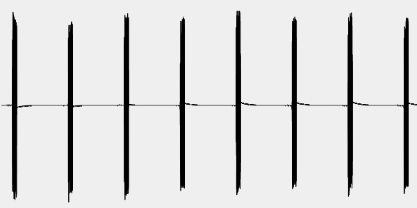
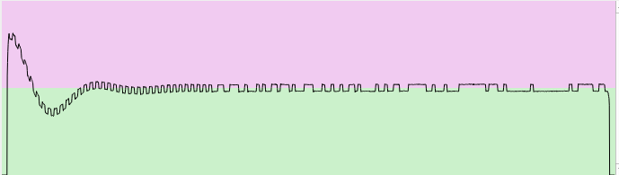

Control a [Xiaomi My Computer Light Bar](https://www.mi.com/global/product/mi-computer-monitor-light-bar/) MJGJD01YL, using a cheap 2.4 GHz radio transceiver module (nRF24L01 or nRF24L01+).

> [!IMPORTANT]
> There are two variants of the light bar, both of them controlled by 2.4 GHz radio signals (see the
> label on the bar for the device number).
> - Device number MJGJD01YL. It uses a TLSR8368 radio receiver and a propiertary radio format. This is
> the one that can be used with this library.
> - Device number MJGJD02YL. It uses a ESP32, wifi and BTLE, and requires a phone app to pair. See 
> [here](https://karlquinsland.com/xaomi-s1-monitor-lamp-teardown-and-tasmota) for many details.

# Requirements

- Xiaomi My Computer Light Bar, model MJGJD01YL.
- Raspberry Pi, or any other device running Linux with GPIOs and a SPI controller, and Python 3.
- nRF24L01(+) module.

# Installation

## Hardware setup

Connect the RPi to the nRF24L01 as shown
[here](https://www.laboratoriogluon.com/conectar-raspberry-pi-3-a-nrf24l01). 

In this document it
will be assumed that the SPI0 bus is used, and therefore `csn_pin=0`. The chip enable will be
connected to GPIO25 (`ce_pin=25`).
See [here](https://nrf24.github.io/RF24/md_docs_rpi_general.html) for the gory details.

## Dependencies

- `pyrf24` [RF24 python library](https://nrf24.github.io/RF24)
- `crc` [CRC python library](https://github.com/Nicoretti/crc)

Notice that `pyrf24` may need to build some dynamic libraries. So, you will need some additional
packages:

- Debian based OS (e.g. Raspberry Pi OS)
```sh
  sudo apt-get install python3-dev libboost-python-dev
  python -m pip install pyrf24

```
- Alpine Linux (e.g. Docker container)
```sh
  apk add --no-cache cmake make g++ boost-dev
  python -m pip install pyrf24

```

# Use

Assuming that pins are `ce_pin=25` and `csn_pin=0` and the id of the remote is `0xABCDEF` (3 byte
long), start with
```python
from lightbar import Lightbar
bar = Lightbar(25, 0, 0xABCDEF)
```
Then you can turn on/off in two ways
```python
bar.send('on_off')
```
or
```python
bar.on_off()
```
The library uses an internal counter that is incremented on each call, required by the bar to
reject repeated consecutive packets (the radio interface has a lot of redundancy). You can use your
own counter (0 to 255), but if you repeat the same value twice or more it will only work the first
time.
```python
bar.on_off(14)  # it works
bar.on_off(15)  # it works
bar.on_off(14)  # it works
bar.on_off(14)  # No, repeated
```

The full list of commands is 
```python
bar.on_off()
bar.colder()
bar.warmer()
bar.stronger()
bar.softer()
bar.reset()
```

# Background

If you are interested in the gory details of the radio and baseband used by the light bar, keep reading.

## Reverse engineering of the radio interface

I have analized the radio signals from the remote using a [HackRF
One](https://greatscottgadgets.com/hackrf/one/) SDR, with [Universal Radio
Hacker](https://github.com/jopohl/urh). The chipset included in the remote and the light bar
(Telink TLSR8368 or simmilar) are common in wireless mice and keyboards. Only the remote acts as a
transmitter, the light bar is just a receiver. Therefore, you can think of the remote as a wireless
mouse (with clicks and wheels), while the bar is like the receiver you plug in a USB port, with no
data transmission to any USB host.

The control uses at least three 2 MHz channels centered at 2406 MHz, 2043 MHz and 2068 MHz. It uses
a rather aggresive frequency-hopping scheme ([thanks, Hedy](https://en.wikipedia.org/wiki/Hedy_Lamarr#Inventor)). Each command is sent as a burst of ten 100 µs identical pulses, repeated each 1300 µs. The time between pulses is used to transmit the same burst in the other channels. A full burst captured by the SDR is shown here.

 

The modulation of the pulses is a simple FSK, with a frequency deviation of ±500 MHz. Below, a
demodulated pulse is shown (that is, the graph is the instant frequency of the signal in terms of
the time):

 

The bit rate is 2 Mbps, and therefore the bit length is 0.5 µs. Each pulse contains a packet of 17
bytes, or 136 bits, equal to 68 µs. The remaining time up to 100 µs corresponds to a synchronization sequence before the bits, to allow the receiver to lock into the signal frequency. I suspect that the wavy shape of the frequency plot during the sync sequence is meant to help the locking process.

## Baseband packet format

A baseband packet (17 bytes) is composed of the following fields
- Preamble (8 bytes), common to all devices, `0x533914DD1C493412`
- Remote id (3 bytes), hardcoded in the remote
- Separator (1 byte), common to all devices `0xFF`
- command id (2 bytes), the 2nd one means something (?)
- sequence counter (1 byte)
- CRC16 checksum (2 bytes)

This structure is compatible with the 
[Telink baseband packet format](http://wiki.telink-semi.cn/doc/ds/DS_TLSR8368-E_Datasheet%20for%20Telink%202.4GHz%20RF%20System-On-Chip%20Solution%20TLSR8368.pdf#page=39), used by the TLSR8368 chip 

Before the packet, a synchronization sequence `0x5555555555` is transmitted (in binary it is just
`0b010101...` ). Notice that the four first bits in the preamble are
`0b0101 = 0x55`, they could be considered still part of the sync sequence. Doing so, the preamble
becames `0x67229ba38926824`. However, this is clearly not a valid approach
- The `0x67...` preamble is 60 bits long, 7 bytes and a half.
- The byte alignment of the other packet fields is broken.
- There are 4 trailing zero bits in all the captured packets.
- The CRC16 checksum cannot be computed.

The [ISM](https://en.wikipedia.org/wiki/ISM_radio_band) 2.4 GHz radio interface is a battlefield
where your wireless mouse, bluetooth headset, and 2.4 GHz wifi (and your neighbour's one) are just
fighting for the spectrum with the leakage from the microwave oven. The strategy against the
corruption of the radio packets is to repeat them many times in bursts (see above), check their
integrity and drop the wrong ones. Then, the redundant ones are also dropped, using the sequence
counter to detect repeated packets.

## Command codes

The command codes that work are the ones in the following table:

| Command | Code 1         | Code 2         | Default |
|---------|----------------|----------------|---------|
| on_off  | 0x01??         | -              | 0x0100  |
| cooler  | 0x0200 + steps | 0x0300 + steps | 0x0201  |
| warmer  | 0x0300 - steps | 0x0400 - steps | 0x03FF  |
| higher  | 0x0400 + steps | 0x0500 + steps | 0x0401  |
| lower   | 0x0500 - steps | 0x0600 - steps | 0x05FF  |
| reset   | 0x06??         | 0x07??         | 0x0600  |

- Steps is a number from 1 to 15. 
- Default is the code sent by the original control.
- The intensity and color scales are 0 to 15.
- Steps out of [1, 15] may temporarily block the control.
- Wrong codes are silently ignored

## CRC checksum

The integrity of a packet is check using a CRC16 checksum (the trailing two bytes in each packet).
I have reverse-engineered it using the excellent tool [reveng](https://reveng.sourceforge.io),
that I found through this
[Hackaday article](https://hackaday.com/2019/06/27/reverse-engineering-cyclic-redundancy-codes).
At least 4 captured packets are required to determine the parameters of the CRC algorithm.
Important, the packets must be correctly byte-aligned (they must start with `0x53`)

```
reveng -w 16 -s 533914DD1C49341201B960FF7901003870 \
                533914DD1C49341201B960FF1601008F2A \
                533914DD1C49341201B960FF1A0100FA4B \
                533914DD1C49341201B960FF200100F82F

width=16  poly=0x1021  init=0xfffe  refin=false  refout=false  xorout=0x0000
check=0x6e62 residue=0x0000  name=(none)
```
The validity of the checksum can be tested by changing the packets. THe parameters of the CRC
checksum should be the same in all cases.

# Signal generation with the nRF24L01(+)

TODO
